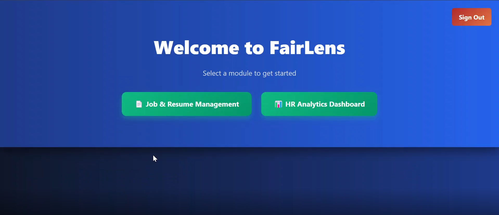
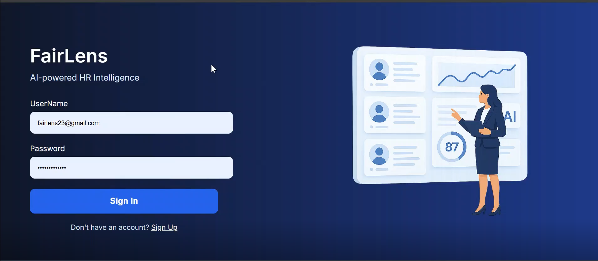
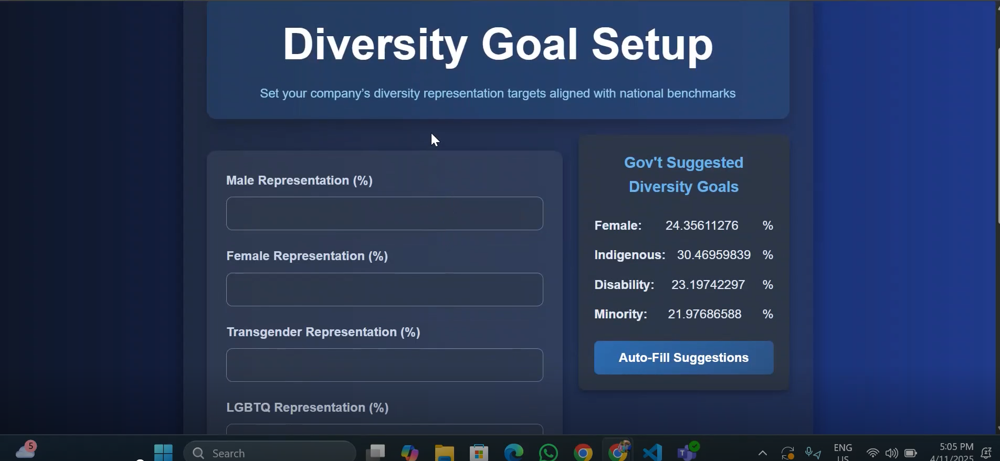
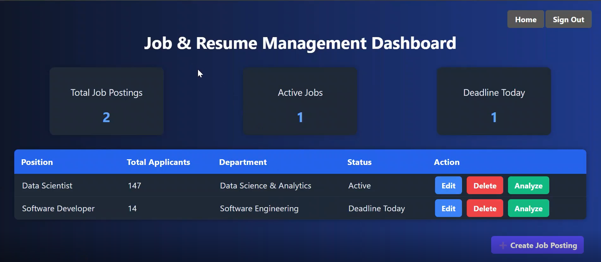
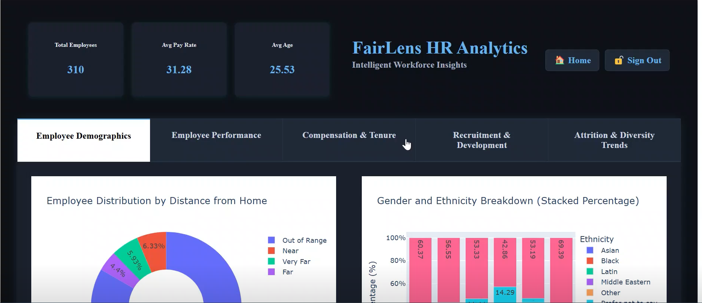
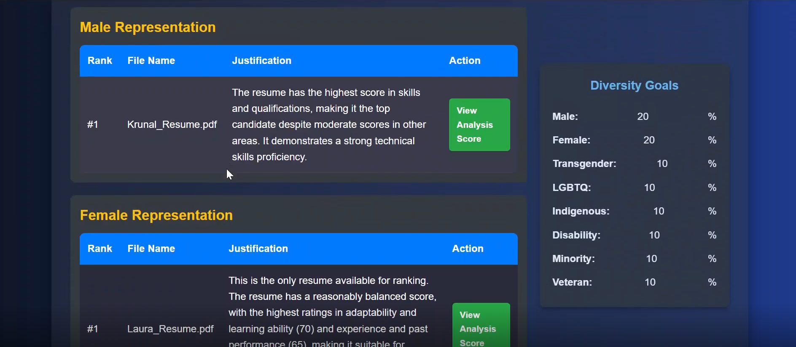
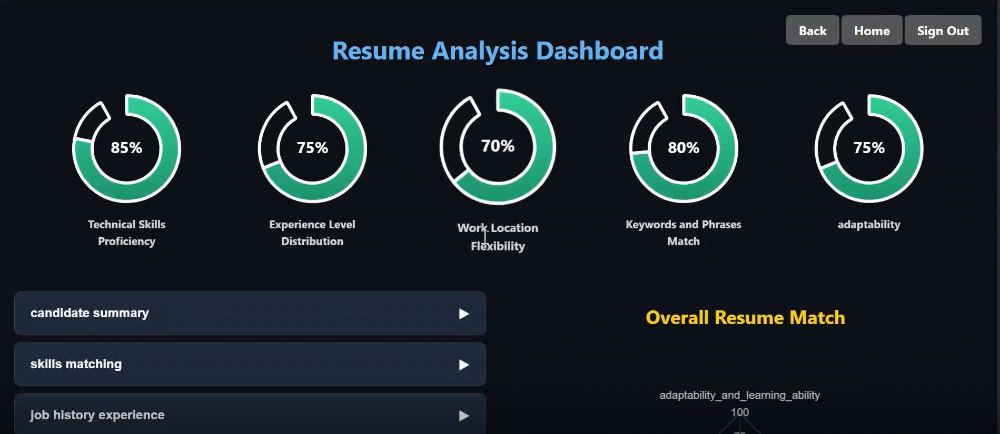
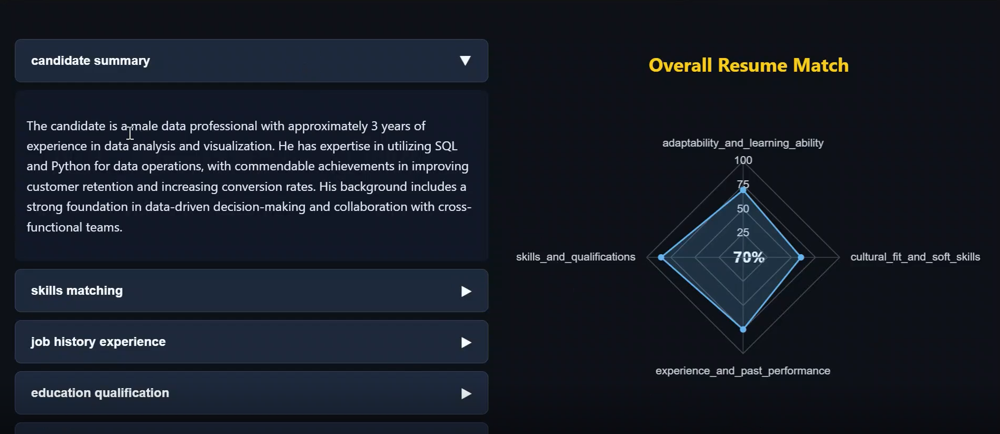
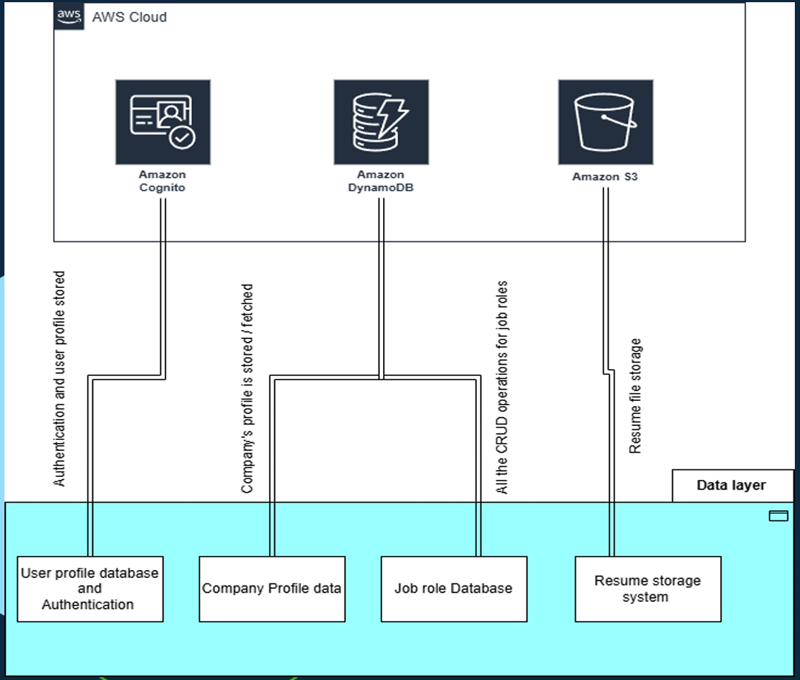

# 🚀 FairLens – AI-Powered Hiring Solution

FairLens is a cloud-based AI platform designed to promote **diversity**, **equity**, and **inclusion (DEI)** in hiring. It uses advanced machine learning models and LLMs to analyze resumes, detect biases, and provide fair candidate shortlisting — all while respecting privacy through PII anonymization.


---

## 🧠 Key Features

- 🤖 **AI-Powered Resume Screening** using LLMs
- 📊 **Real-Time Diversity Dashboard** (Dash-based UI)
- 🔒 **PII Anonymization** for candidate data security
- 🎯 **Custom Diversity Goal Setup** for companies
- ☁️ **Secure Cloud Infrastructure** with AWS Cognito, S3, and DynamoDB
- 💸 **Cost-Optimized Resume Parsing** using GPT-4o Mini (~$0.000075 per resume)

---

## 📸 UI Screenshots

### 🔐 Login Page


### 🎯 Diversity Goal Setup


### 🏠 Home Page


### 📋 Job and Resume Management Dashboard


### 📊 HR Analytics Dashboard


### 📈 Resume Analysis Based on Diversity Goals


### 🧠 Individual Resume Analysis (v1)


### 🧠 Individual Resume Analysis (v2)



---

## 🛠 Tech Stack

- **Languages:** Python, HTML, CSS, JavaScript
- **Frameworks/Libraries:** Flask, Dash, Pandas, Scikit-learn, XGBoost, SVR, LangChain
- **Cloud:** AWS Cognito, S3, DynamoDB, Boto3
- **AI & ML:** OpenAI GPT-4o Mini, Random Forest, XGBoost, SVR
- **DevOps & Deployment:** Modular MVC structure, secure AWS hosting

---

---

## ☁️ AWS Cloud Architecture

FairLens is built on a robust, scalable, and secure AWS infrastructure that supports its data processing, storage, and authentication needs.

### 🔧 AWS Services Used

| Service            | Purpose                                                                 |
|--------------------|-------------------------------------------------------------------------|
| **Amazon Cognito** | User authentication and identity management                             |
| **Amazon S3**      | Scalable storage for resumes and static assets                          |
| **Amazon DynamoDB**| NoSQL database for storing structured company and job data              |
| **AWS Boto3 SDK**  | Python SDK for seamless interaction with AWS services                   |

### 🗺️ Architecture Diagram



> This architecture ensures seamless integration, low-latency performance, and secure handling of sensitive candidate data.

---
## 🏗️ System Architecture

### 📦 Project Structure

```
fairlens/
├── app.py
├── dashboard/               # Dash UI
├── anonymizer/              # PII Anonymization logic
├── resume_parser/           # Resume handling and ML logic
├── auth/                    # AWS Cognito integration
├── utils/                   # Helper modules
├── static/                  # CSS/JS files
├── templates/               # HTML templates
├── requirements.txt
└── README.md
```

---

## ⚙️ Setup & Installation

### 🔐 Replace Environment Variables

Update the following placeholders in your `.env` or config file:

```bash
OPENAI_API_KEY=“<your-openai-api-key>”
COGNITO_REGION="us-east-1"
COGNITO_USER_POOL_ID="<your-user-pool-id>"
COGNITO_CLIENT_ID="<your-client-id>"
COGNITO_CLIENT_SECRET="<your-client-secret>"
```

### 📥 Installation Steps

```bash
git clone https://github.com/<your-username>/fairlens.git
cd fairlens
pip install -r requirements.txt
python app.py
```

---

## 🔍 How It Works

1. **Company Onboarding:** Register your organization and set diversity goals.
2. **Resume Submission:** Upload resumes and job descriptions.
3. **Resume Parsing & Anonymization:** All resumes are anonymized before analysis.
4. **AI Shortlisting:** Candidates are matched using LLMs + diversity-weighted scoring.
5. **Diversity Dashboard:** Monitor team composition and hiring pipeline health.

---

## 📊 Dashboard & Analytics

- Live DEI statistics by role, department, and funnel stage
- Predictive analytics for attrition, gender ratio, and performance
- AI-generated insights for recruitment policy improvements

---

## 📈 Machine Learning Models

| Model | Algorithm | Purpose |
|-------|-----------|---------|
| Attrition Prediction | XGBoost | Predicts risk of employee attrition |
| Gender/Diversity Forecast | Random Forest | Tracks inclusion metrics over time |
| Team Performance | SVR | Evaluates team performance vs. size |
| Resume Screening | LLM + LangChain | Identifies top candidates & removes bias |

---

## 🌐 Real-World Impact

- ⚖️ Reduced unconscious bias in screening
- 👥 Increased underrepresented hires (by skill match)
- 📉 Cost reduced to ~$0.000075/resume using GPT-4o Mini
- 🔐 PII anonymization ensures candidate privacy

---

## 🧪 Empirical Study Basis

FairLens uses dynamic weighting logic based on:
- **Province-level diversity data** (e.g., Statistics Canada)
- **User-defined hiring objectives**
- **Bias detection heuristics & LLM transparency**

For example:
> *If the average representation of women in Manitoba is 48% compared to the national 55%, the diversity weight for women will be: 55/48 = 1.15.*

---

## 🚧 Future Roadmap

- Integrate with LangChain agents for job-specific reasoning
- Add feedback loops to fine-tune AI shortlisting
- Expand to multilingual resume processing

---

## 🤝 Contributors

- **Bhagyesh Jayeshbhai Patel**  
- **Hetkumar Dineshbhai Patel**  
- **Parth Jigneshkumar Patel**  
**Supervisor:** Prof. Kobra Khanmohammadi


---

## 📬 Contact

For questions or demo access:
- patelbhagyesh07122003@gmail.com  
- [LinkedIn](https://www.linkedin.com/in/13hagyesh/)

---

> **FairLens** — Because every qualified candidate deserves a fair shot. 🌍
---

## 📦 Requirements

Before running the project, install the required Python packages:

```bash
pip install -r requirements.txt
```

---

## ☁️ AWS Services Used

FairLens utilizes a suite of AWS cloud services to ensure scalability, security, and performance:

| AWS Service     | Purpose                                                                 |
|------------------|-------------------------------------------------------------------------|
| **Amazon Cognito** | User authentication and profile management                            |
| **Amazon DynamoDB** | Structured data storage (job roles, company info, etc.)              |
| **Amazon S3**     | Storage for resume documents and other unstructured data               |
| **AWS Boto3 SDK** | Python interface for communication with AWS services                   |

---

## 🔁 End-to-End Flow Diagram

```
+------------------+
| Company Registers |
+--------+---------+
         |
         v
+------------------------+
| Set Diversity Goals    |
+--------+---------------+
         |
         v
+------------------------+
| Create Job Description |
+--------+---------------+
         |
         v
+------------------------+
| Upload Resumes         |
+--------+---------------+
         |
         v
+------------------------------+
| Resume Parsing & Anonymizer |
+--------+---------------------+
         |
         v
+------------------------------+
| AI Screening (LLMs + ML)     |
+--------+---------------------+
         |
         v
+------------------------------+
| Candidate Shortlist          |
+--------+---------------------+
         |
         v
+------------------------------+
| Diversity Dashboard & Report |
+------------------------------+
```

---

> **FairLens** empowers organizations to make informed hiring decisions with transparency and accountability, combining fairness and performance at every step.
